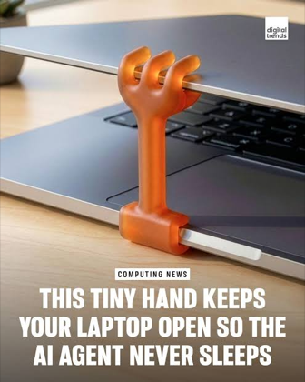

<h1 align="center">v-claw</h1>

<p align="center">
  
</p>

<p align="center">
  <strong>A macOS menu bar app that holds your laptop open.</strong><br>
  Stops the machine sleeping when the lid closes, stops the screen locking,<br>
  and ties both to the power adapter.
</p>

<p align="center">
  
  
  
  
</p>

---

## Why it is called v-claw



People 3D-print a little claw to prop a laptop lid open, so the machine keeps running
while the agent works.

v-claw does the same job in software. No plastic required.

Plug in, and it engages. Unplug, and it releases. The menu bar always shows which.

<br clear="right">

## What it does

| | |
|---|---|
| **Stays awake on the adapter** | Blocks idle sleep, display sleep, and lid-close sleep while plugged in |
| **Stops the screen lock** | Keeps the display awake, so the screensaver never starts and the lock never fires |
| **Virtual lock** | Covers the screen while you are away, without letting the machine sleep |
| **Releases on its own** | On unplug, on a timer, and when the app stops responding |
| **Works without admin** | Most of it needs no privileges at all |

## Install

Two commands, split by the privilege each one needs.

```sh
git clone https://github.com/kamrul1157024/v-claw
cd v-claw

make install          # no sudo. Menu bar app, idle and display sleep blocked.
make install-daemon   # sudo, once. Adds guaranteed lid-close blocking.
```

The first command is enough to be useful. The second is an upgrade.

`make install` builds from source, so the app carries no quarantine attribute and
Gatekeeper does not block it. No Developer ID and no notarization are needed.

**Requirements:** macOS 13+, Go 1.24+, and Xcode Command Line Tools. Xcode itself is
not required.

### Why the split

Many people run Macs that an organisation manages, where admin rights arrive only by
request and only for a short window.

So v-claw asks for admin **once**, at install, and never again. The privileged install
script is three lines, and you can show an IT reviewer exactly what it does:

```sh
make explain
```

Everything else runs unprivileged.

## Usage

The menu bar icon is the whole interface.

```
 Status: AC Power — awake (full)
 ────────────────────────────────
  ○ Off
  ○ Always awake
  ● Auto (on AC)
 ────────────────────────────────
  ☑ Block lid sleep
  ☑ Keep display on
 ────────────────────────────────
  Awake for              ▸
 ────────────────────────────────
  Lock screen now
  Virtual lock           ▸
 ────────────────────────────────
  Quit v-claw
```

### Icon states


| | State | Meaning |
|---|---|---|
| 1 | **Off** | v-claw is changing nothing |
| 2 | **Armed** | Auto mode, on battery, waiting for the adapter |
| 3 | **Active** | Sleep is blocked right now |
| 4 | **Basic** | Active, but lid blocking is best effort — the helper is not installed |
| 5 | **Overridden** | Something is overriding v-claw. Run `v-claw diagnose` |

The claw grips a bar. The bar is the lid.

### Command line

```sh
v-claw status        # what is active right now
v-claw on 2h         # always awake, for two hours
v-claw auto          # awake only on the adapter
v-claw off
v-claw diagnose      # full report, including managed-Mac overrides
```

The menu bar app picks up CLI changes within a few seconds, and vice versa.

## Safety

> [!WARNING]
> A closed lid on a machine that cannot sleep traps heat. In a bag, that is a real risk.

The failure mode here is silent and physical, so v-claw is built around it:

- The menu bar icon always shows the live state. Filled means active.
- Everything releases on its own: on unplug, when a timer expires, and when the app
  stops sending a heartbeat.
- The daemon releases within five minutes if the app crashes, so root can never be left
  holding the machine awake with no UI to turn it off.
- `make uninstall-daemon` restores the settings recorded before v-claw first ran.

Use `Awake for ▸` rather than `Always awake` when you can.

## The virtual lock is not a lock

> [!CAUTION]
> It is a **privacy screen**, not a security boundary.

It covers your displays so nothing private is readable, and it keeps the machine awake
while it does. That is the point: the real macOS lock is tied to display sleep, and
display sleep is what v-claw is preventing.

But it is an ordinary window drawn by an ordinary user process. Anyone with physical
access defeats it. **If you need a real security boundary, use the macOS lock and accept
the display sleep.**

Two unlock policies:

| Policy | Dismissed by | Use for |
|---|---|---|
| **Any key** | any key or click | A privacy screen. Coffee shop, shared desk. |
| **Touch ID or password** | `LocalAuthentication` | A weak lock. Stops a colleague, not an attacker. |

v-claw never sees, stores, or compares your password. The OS performs the check.

## On a managed Mac

MDM can defeat v-claw in ways that look like bugs. It will tell you which:

```sh
v-claw diagnose
```

The report names the cause — a profile forcing an immediate lock, a reverted `pmset`
write, a blocked LaunchDaemon — instead of failing silently.

## How it works

Three binaries share one state file. No XPC, no custom IPC.

```
v-claw.app   you    Menu bar UI. Holds IOKit assertions. Writes state.json.
v-clawd      root   LaunchDaemon. The only privileged part. Applies pmset.
v-claw       you    CLI. Same state file.
```

Two capability tiers:

| Tier | Admin | Idle sleep | Display sleep | Lid close |
|---|---|---|---|---|
| **Basic** | none | blocked | blocked | best effort |
| **Full** | once, at install | blocked | blocked | guaranteed |

Full specification in [docs/spec](docs/spec/).

## Platforms

macOS ships first. Linux and Windows are planned, and the platform boundary is already
in the code.

| Platform | Status | Lid blocking |
|---|---|---|
| macOS | **v1** | `pmset disablesleep`, needs the helper |
| Linux | planned | logind inhibitor — **needs no root at all** |
| Windows | planned | power-scheme `LIDACTION`, needs admin |

## Uninstall

```sh
make uninstall           # no sudo
sudo make uninstall-daemon
```

Your original power settings are restored.

## Licence

MIT.
